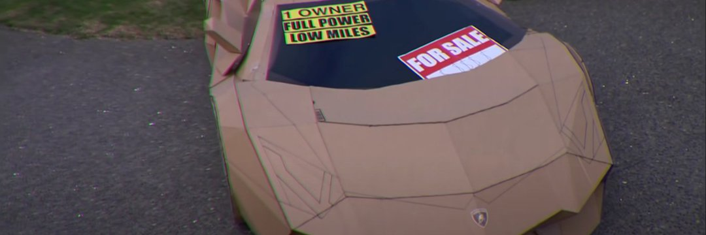

PolyMax 是 Polygon 网络上的一个新的单产农业 Dapp。我们的目标是提供超越市场的价值（我们的存款费用为 3.5%，而其他农场的费用为 4%），同时在 APR 方面不提供任何东西。那是 12.5% 的折扣，保留在我们社区成员的钱包里——就在这些硬币所属的地方。我们希望您喜欢我们的项目，并期望它会帮助您资助您未来的月球愿望（或 Lambos，我们知道加密社区也非常喜欢这些。）

