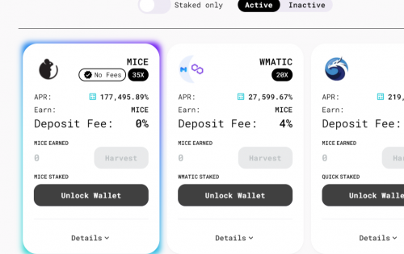

Polymouse Finance 是一个建立在 Polygon 上的去中心化收益农场，其中包括 NFT、IFO 和去中心化 AMM 等其他实用程序。

Polygon的愿景是建造以太坊的区块链互联网。简而言之，Polygon提供了一个通用框架，允许开发人员利用以太坊安全性创建定制的，专注应用程序的链，并提供一个可互操作的网络，将各种不同的扩展解决方案链接在一起，例如zkrollup，op-rollup和侧链。

