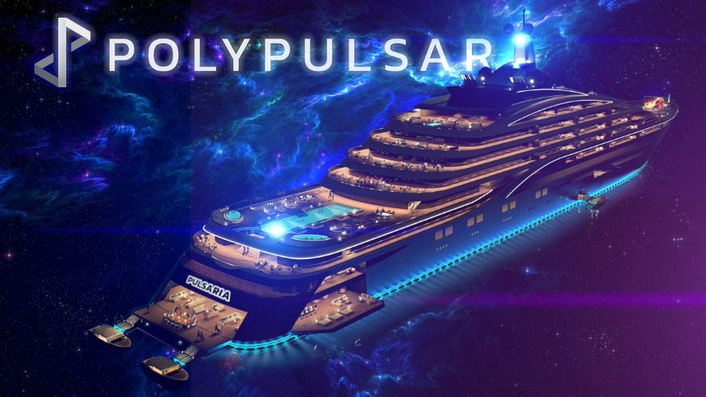

Polypulsar 是一个具有单产农业功能的区块链游戏项目。Gamma Polypulsar 是一个用于单产农业和区块链游戏的混合平台。这是我们在区块链上创建 MMORPG 游戏之旅的第四层。该项目提供 2 个 PvE 和 1 个 PvP 游戏，玩家可以获得丰厚的奖励。

**Gamma Polypulsar 将提供：**

**启动时：**

- 单产农业
- PvE：赏金猎人
- PvE：多星系猎人
- PvP：波萨雷娜

**启动后：**

- 二级市场
- 带有 NFT 物品掉落的龙与地下城游戏
- 一个新的 pvp 游戏，可以用装备的物品玩

