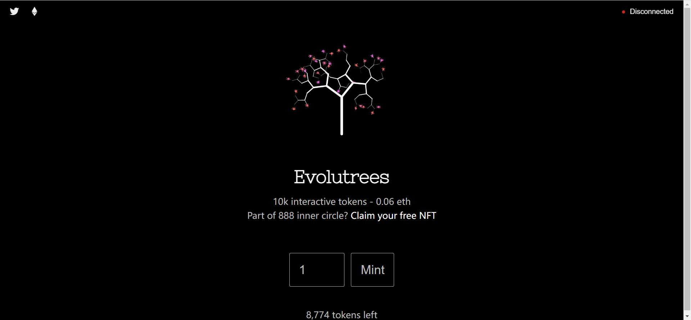

进化树
10k 交互式代币 - 0.06 eth

888内圈的一部分？领取你的免费 NFT

Evolutrees 是随时间生长的生成性和动画树的集合。每棵 Evolutree 都在不断进化，直到被冻结。

Evolutrees 是一个 NFT（不可替代令牌）集合。存储在区块链上的数字艺术品集合。

总共有 1,226 个 Evolutrees NFT。目前，473 位所有者的钱包中至少有一个 Evolutrees NTF。

