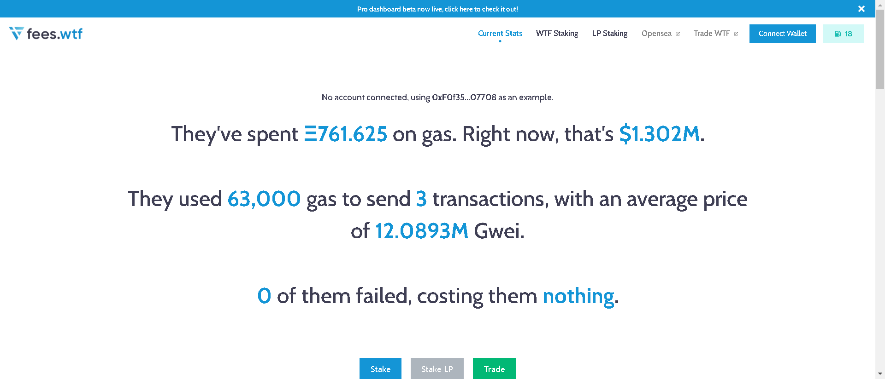

通过领取您的空投，您不仅领取了免费的 WTF代币，还领取了其他一些物品和福利，包括：

- 官方费用.wtf 'rekt' NFT
- 在 fee.wtf 访问即将推出的 Pro Dashboard（同时持有 rekt NFT）
- 具有可扩展 ETH 奖励的推荐链接

拥有一个健康的国库会创造许多潜在的机会。该国库将在启动时以 4000 万WTF为种子，并随着时间的推移由代币转移产生的内部 WTF转移费用的一部分进行补充。在启动时，金库将被锁定，同时建立 DAO 以提供治理。

