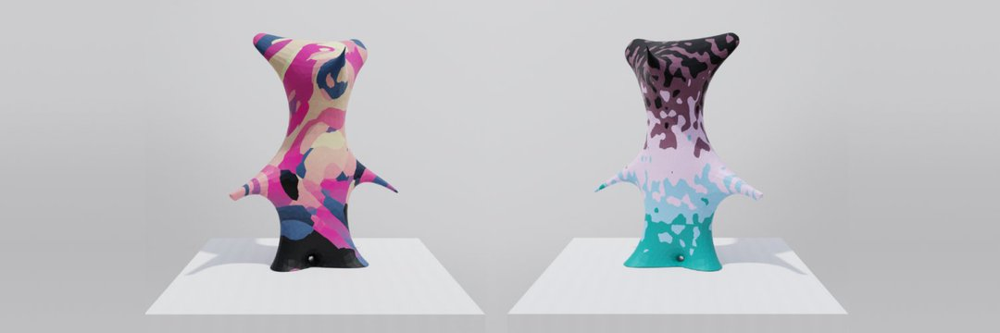

无监督是机器幻觉的一部分，Refik Anadol Studio 正在进行的项目探索基于集体视觉记忆的数据美学。展览在机器的脑海中处理了来自现代艺术博物馆大量收藏的 138,151 条元数据。使用 StyleGAN2 ADA 在多维空间中捕捉机器对现代艺术的变革性“幻觉”，Anadol 使用 MoMA 艺术品收藏档案的子集训练了一个独特的 AI 模型，创建了 1024 个维度的嵌入。然后将排序后的图像数据集聚类为主题类别，以更好地理解数据的语义上下文。这个不断扩大的数据世界不仅将数据的插值表示为综合，但也成为一个潜在的宇宙，其中幻觉的潜力来自一种新颖的艺术创造力形式，诠释了 MoMA 无与伦比的现代和当代艺术收藏。—Refik Anadol

