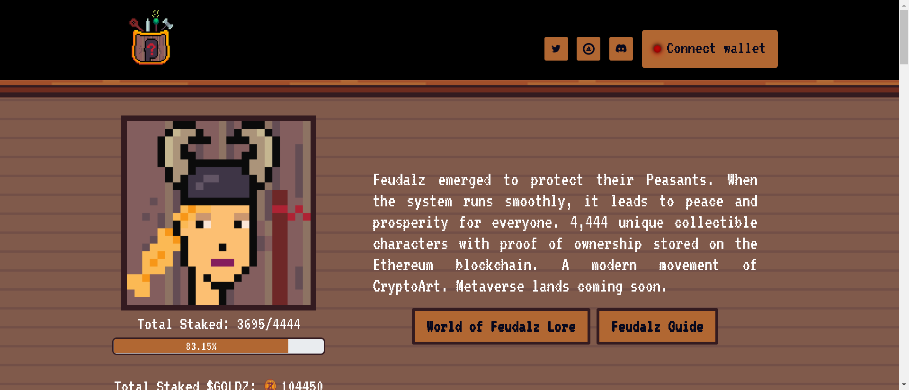

Feudalz Animalz 是一个 NFT（非同质代币）集合。存储在区块链上的数字艺术品集合。

总共有 3,656 个 Feudalz Animalz NFT。目前，1,114 位车主的钱包中至少有一个 Feudalz Animalz NTF。

封建制出现以保护他们的农民。当系统顺利运行时，它会给每个人带来和平与繁荣。4,444 个独特的可收藏角色，以及存储在以太坊区块链上的所有权证明。CryptoArt 的现代运动。元界即将登陆。

