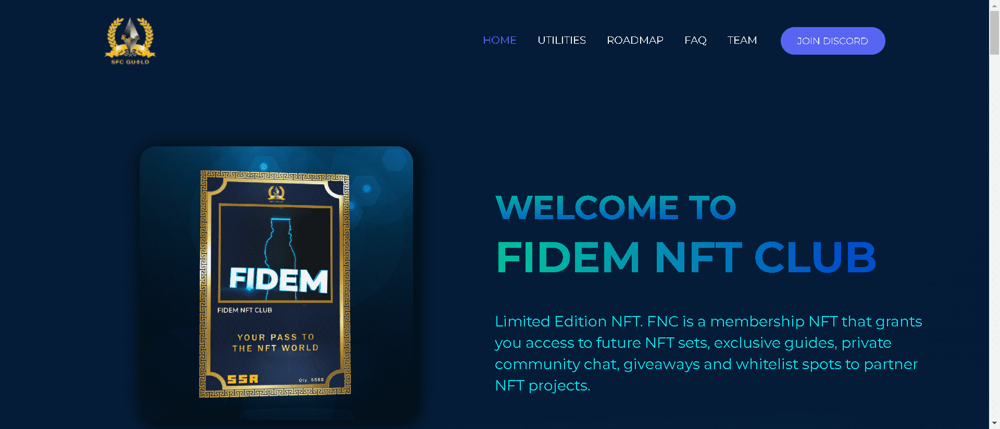

Fidem NFT CLUB 是会员制 NFT，可让您访问未来的 NFT 集、独家交易指南、私人社区聊天、赠品和合作 NFT 项目的白名单。

FNC 持有者之一将有机会成为即时 M。

发展我们的社区以及社交社交媒体平台。目前，我们共有 12K 不和谐成员和 300 多名 AXIE 学者。我们的目标是建设和发展，以便我们可以在未来提供更多帮助。

作为我们持有者的一部分，您在我们的社区服务器上拥有特殊的角色，可以独家访问付费交易课程、现金和 NFT 赠品。持有者拥有终生会员资格，可以为您带来即将到来的未来企业、合作伙伴 NFT 的白名单。最特别的是，一定比例的特许权使用费将分配给持有人。

