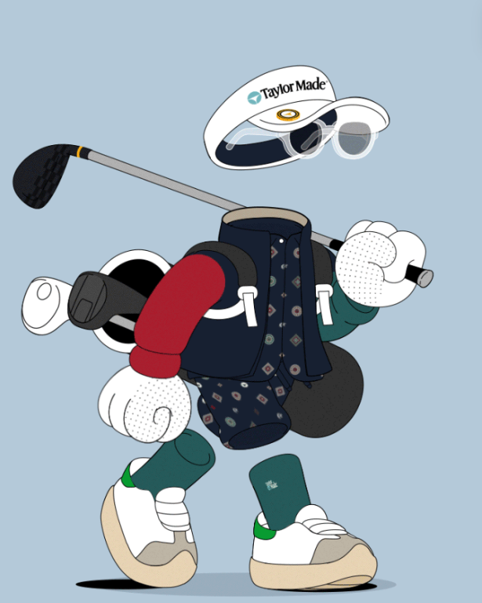

项目网站、社交联系方式、项目介绍内容详见：https://opensea.io/collection/friendsofficials Kith 是世界上最著名的生活方式品牌之一。我们非常高兴能与他们合作，雄心勃勃地在数字和物理之间架起一座桥梁。

Kith 首席执行官兼创意总监 Ronnie Fieg 与 Markus Magnusson 合作设计了一系列被称为 Kith Friends 的 NFT 收藏品。这些 Friends 将首次亮相 Kith 即将推出的 2022 年夏季系列，以及穿着 Kith for Invisible Friends 产品的版本单品。这些特殊 NFT 的持有者将获得其 Kith Friend 所穿的所有实物产品。

**5 月 18 日至 5 月 20 日推出**

