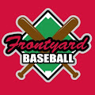

Frontyard Baseball - 一款 P2E NFT 游戏，您可以在其中赢取真钱并回馈社区

拥有、玩耍、打出本垒打并赚钱！官方合作伙伴

[@PolygonStudios](https://twitter.com/PolygonStudios) 现在铸币！二级市场通过

@hawku_com](https://twitter.com/hawku_com)

你玩，我们付钱

Frontyard Baseball 是一款有趣且令人兴奋的基于 9v9 策略的棒球游戏，您可以在其中拥有**自己**的球员并通过玩游戏来**赚取加密货币。**

这是终极加密棒球游戏！建立您的梦之队，成为传奇人物并在获胜时赚取奖金。

当前铸币厂价格：0.04 wETH

Polygon 区块链上有 25,000 个 Frontyard Kids。每个孩子都是一个 NFT，拥有你将拥有的独特统计数据。

场上只有一个 Frontyard Kid，您就可以参加棒球比赛。在每场胜利中赚取 ETH

