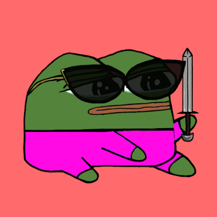

项目网站、社交联系方式、项目介绍内容详见：https://opensea.io/collection/frogfamily

青蛙家族是如何产生的？什么时候薄荷？是什么决定了我得到的青蛙？为什么是3000？为什么不是一万？为什么这个社区更好？如何使用元掩码？什么是 NFT？我什么时候可以看到我的 NFT 我的小青蛙能做什么？青蛙家族养了多少只小青蛙？我什么时候可以买到一些毒品商品？会有空投吗？我的青蛙朋友会永远爱我吗？

