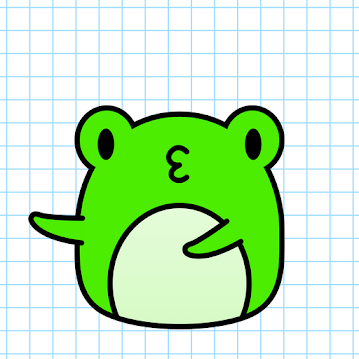

项目网站、社交联系方式、项目介绍内容详见：https://opensea.io/collection/froggies-beginnings

▶ 什么是 Froggies 的开端？
Froggies Beginnings 是一个 NFT（非同质代币）集合。存储在区块链上的数字艺术品集合。
▶ 有多少 Froggies Beginnings 代币？
总共有 4,096 个 Froggies Beginnings NFT。目前，1,598 位所有者的钱包中至少有一个 Froggies Beginnings NTF。
▶ 最昂贵的 Froggies Beginnings 销售是什么？
Froggies Beginnings NFT 售出的最昂贵的是 . 它于 2022-08-16（10 天前）以 1.4 美元的价格出售。
▶ 最近卖出了多少 Froggies Beginnings？
过去 30 天内售出了 1 个 Froggies Beginnings NFT。
▶ 什么是流行的 Froggies Beginnings 替代品？
许多拥有 Froggies Beginnings NFT 的用户还拥有 DystoAzuki、 Superfuzz The Bad Batch、 RichKidsOfficial和 Spooky Frens Collection。

