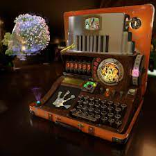
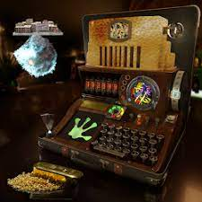
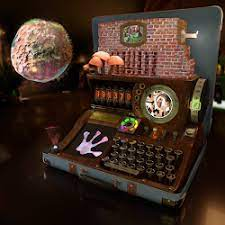

项目网站、社交联系方式、项目介绍内容详见：https://opensea.io/collection/frogland-computational-toadex

你在吗！您是否经常对无聊的像素土地的纸质土地契约感到失望？你想成为酷孩子中的一员，并拥有自己的 NFT 契约，但不知道从哪里开始吗？你有没有想过“我希望我有一台谜机器，它可以重组物质，形成通往其他领域的门户，进行一次没人会相信的（可能是元宇宙）旅行？”好吧，不要再看了！Frogland Computational Toadex可持续地源自分解的外星技术，并由REDACTED重新利用，手工制作成您梦想中的多功能、多维、众多、多媒体土地合成设备！

