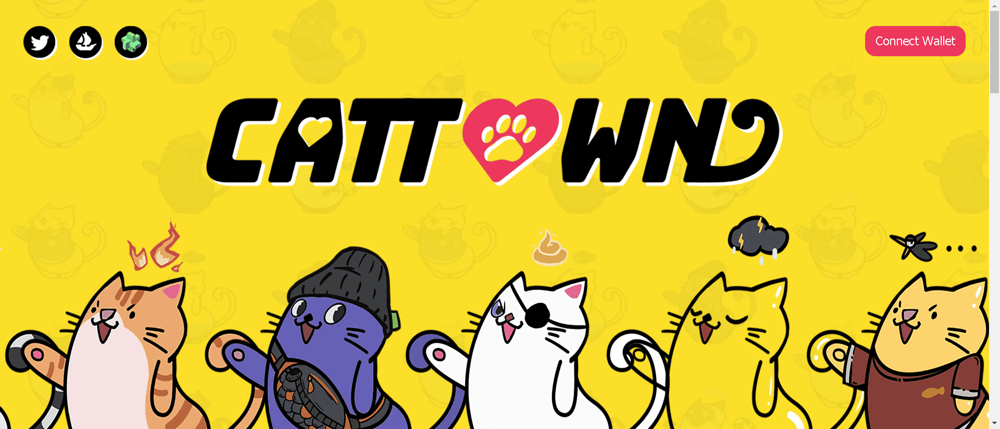

MeowMeow Planets 是以太坊区块链上 10,000 个启用实用程序的 PFP 的集合，它是 Cattown 的起源 NFT。由于第一支团队提出了 NFT VAT 的概念，Cattown 被设计为一个社区驱动的项目，$CAT 代币 100% 流向社区。铸造和交易 Cattown NFT 的参与者将立即获得 $CAT 代币奖励。

CAT 代币的总供应量为 100 亿枚。IDO 价格为 0.001 美元。30% 的代币将用于 NFT 铸造和交易奖励，30% 用于挖矿和游戏奖励，20% 用于支持合作 NFT 项目，合作伙伴 NFT 需要支持 NFT 增值税协议并增加 $CAT 的流动性。10% 用于增加流动性。10% 作为 CAT DAO 国库资金赞助流浪猫救助组织。

