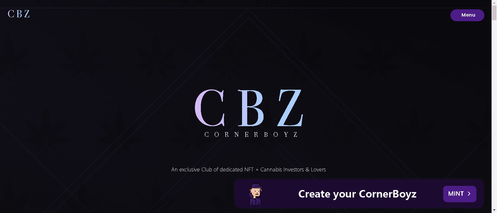

420 种独特种子的集合。一段时间后，您的种子将变成一朵完全成熟的花朵，您的菌株将显露出来，为其持有者带来 IRL 好处。

一段时间后，您的种子将变成一朵完全成熟的花朵，您的菌株将显露出来，为其持有者带来 IRL 好处。要获得持有应变 NFT 的好处，必须首先等待你的应变显露出来。

在我们在加利福尼亚州马里布举行的 IRL 年度活动中，质押您的 Strain NFT 并与其他人竞争获得 CBZ 年度最佳种植者奖。

质押您的 Seed NFT 以发展您现有的 Strain NFT 以获得更多收益，或者将其出售以获得 $$$。

