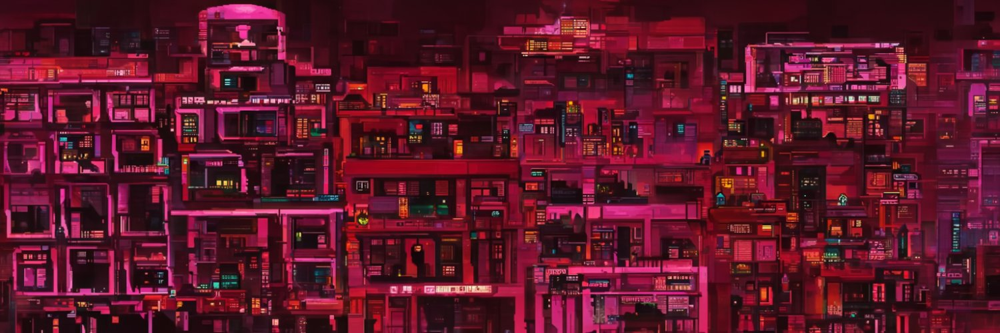

一切都是混音，照顾病人很重要，客户要跟着他们，但同时他们也会受到一些巨大的痛苦和痛苦的影响。

▶ 什么是 CC0 x ricky？
CC0 x ricky 是一个 NFT (Non-fungible token) 集合。存储在区块链上的数字艺术品集合。

▶ 存在多少个 CC0 x ricky 代币？
总共有 7 个 CC0 x ricky NFT。目前 37 位所有者的钱包中至少有一个 CC0 x ricky NTF。

▶ 最贵的 CC0 x ricky sale 是什么？
卖得最贵的 CC0 x ricky NFT 是 Red Lite 区的 Dusk。它于 2022-06-04（3 个月前）以 12.6 美元的价格售出。

