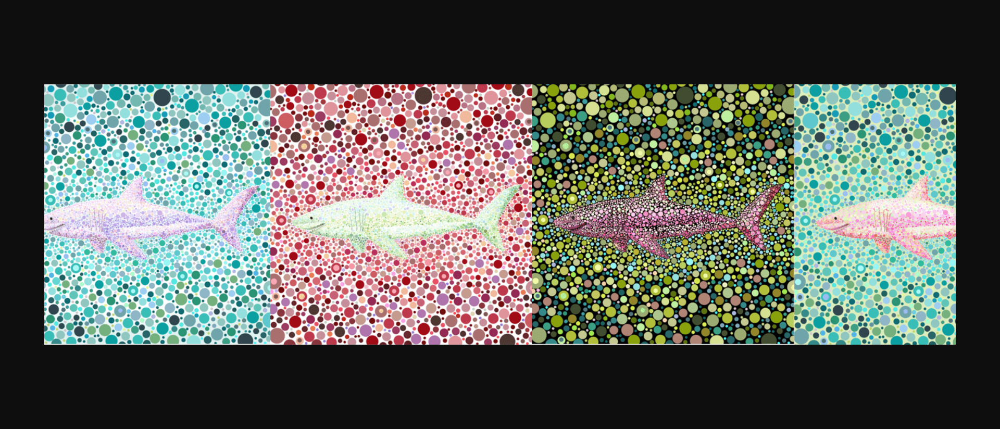

“点鲨鱼”是“点动物”系列的第一个系列。dot生态群落中将有多种物种。向“点鲨”问好

##### ▶ 什么是CertainHappiness？

CertainHappiness 是一个 NFT（非同质代币）集合。存储在区块链上的数字艺术品集合。

##### ▶ 有多少个CertainHappiness 代币？

总共有 9 个CertainHappiness NFT。目前 3 位所有者的钱包中至少有一个CertainHappiness NTF。

