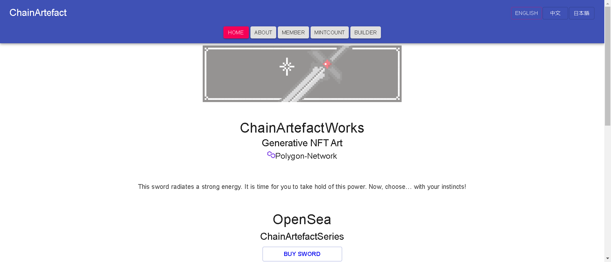

全链人工制品系列。武器版。

这手臂散发出强大的能量。现在是你掌握这种力量的时候了。现在，选择……用你的直觉！

▶ 什么是 ChainArtefact（武器）？
ChainArtefact(Arms) 是一个 NFT (Non-fungible token) 集合。存储在区块链上的数字艺术品集合。

▶ 存在多少个 ChainArtefact(Arms) 代币？
总共有 3,459 个 ChainArtefact(Arms) NFT。目前 233 位所有者的钱包中至少有一个 ChainArtefact(Arms) NTF。

