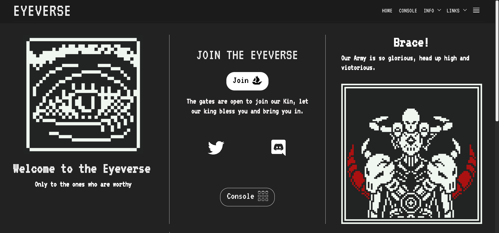

Eyeverse 官方 NFT 是一个 NFT（Non-fungible token）集合。存储在区块链上的数字艺术品集合。

总共有 1,751 个 Eyeverse 官方 NFT NFT。目前 353 位所有者的钱包中至少有一个 Eyeverse 官方 NFT NTF。

一个黑暗和微光的世界一个神秘的世界和许多战斗的领域。眼王是拥有眼王圆桌会议的优越生物。带领守夜人和守夜人军队统治所有守望者的眼领主

