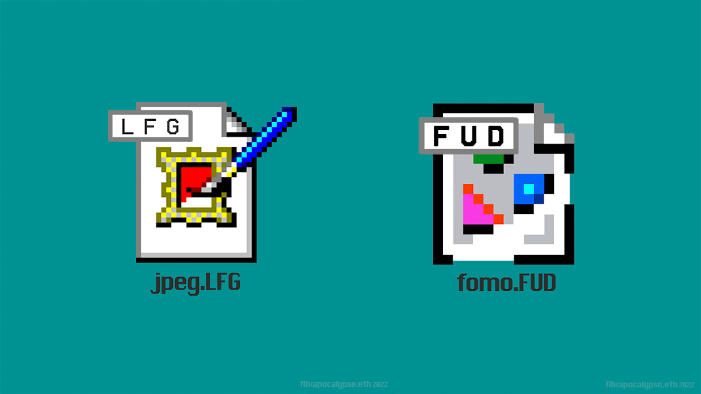

▶ 什么是 f0xapocalypse？
f0xapocalypse 是一个 NFT（不可替代令牌）集合。存储在区块链上的数字艺术品集合。

▶ 存在多少个 f0xapocalypse 代币？
总共有 18 个 f0xapocalypse NFT。目前 8 位所有者的钱包中至少有一个 f0xapocalypse NTF。

通讯和视觉艺术家🎥🎨🖌️| 区块链革命在这里 | Web3 THOT 领导者

