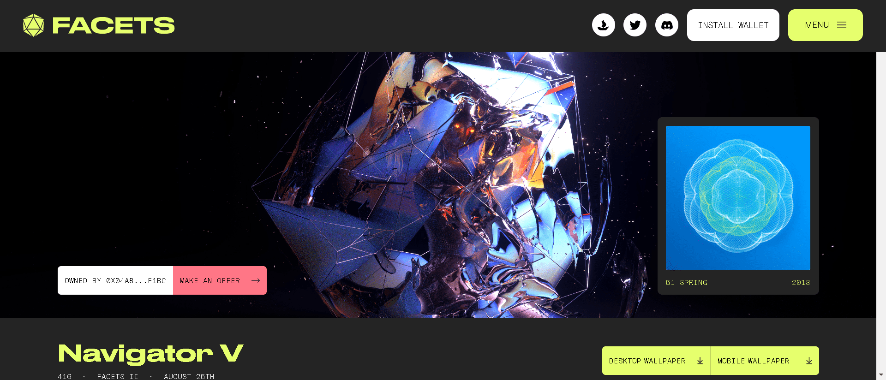

2013 年，澳大利亚艺术家 Justin Maller 创作了 Facets I：一个为期一年的日常艺术项目，包含 365 件独特的作品。该系列受到数亿人的关注，以其标志性的几何和抽象风格打造了一个标志性品牌。该项目巩固了他对视觉艺术世界和科技创意文化的影响。

随着 Maller 准备开始他为期一年的日常单品系列 Facets II 的工作，他已经标记了整个原始系列，并邀请收藏家在真正的创意之旅中陪伴他享受独特的互动体验。

