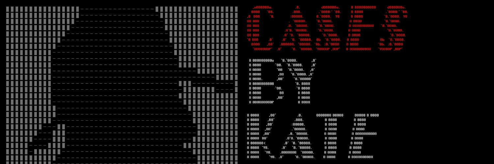

如果您在主屏幕的“冷案查询”中输入特定的案件编号，您可以检查案件是否已经被人工智能铸造。

Cases By Kate 是世界上第一个韩文生成文本 NFT。关于谋杀嫌疑人的 10,000 条线索的集合。提供了一个寻找嫌疑人的模拟器和一支香烟。

Facts By AI 是一款结合文本 NFT 和 AI 技术打造的 AI NFT，是 Cases By Kate 的衍生项目。 允许您从犯罪现场的闭路电视摄像机数据中制作证词。您需要一个案例来铸造您自己的 AI 证词，也可以尝试多次检查您的证词。要通过 AI 铸造 Facts，您必须支付 1 MIX。

