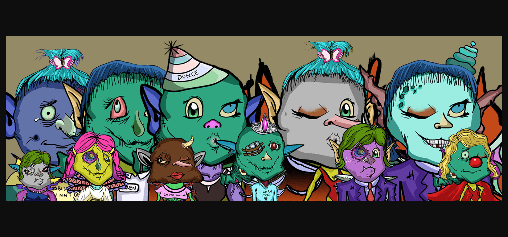

▶ 什么是仙境wtf？
Fairytownwtf 是一个 NFT（非同质代币）集合。存储在区块链上的数字艺术品集合。

▶ 有多少fairytownwtf 代币？
总共有 3,329 个fairytownwtf NFT。目前 333 位车主的钱包里至少有一个 fairytownwtf NTF。

▶ 最昂贵的fairytownwtf 销售是什么？
售出的最昂贵的fairytownwtf NFT 是 fairytown.wtf #279。它于 2022-06-08（3 个月前）以 27.2 美元的价格售
