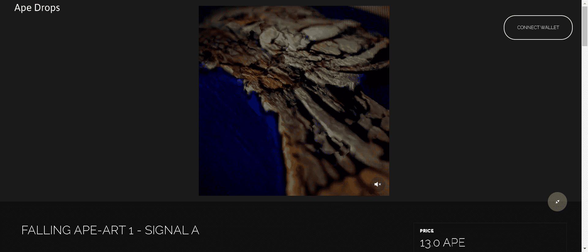

“Falling Ape-Art”系列是与受过 BAYC 和 MAYC 系列训练的机器学习系统合作创建的。虽然输出由 Strangeloop 的团队处理和操作，但该过程的基础不受人为控制。随着每只猿融入下一只猿，个体消失，露出下面无所不在的诡计。

Strangeloop 内部创作的音乐。

在制作这个系列时没有任何猿类受到伤害。

Strangeloop Studios 是一个位于洛杉矶的创意团体。他们为 The Weeknd、Flying Lotus、Lil Nas X 等设计了视觉效果。

