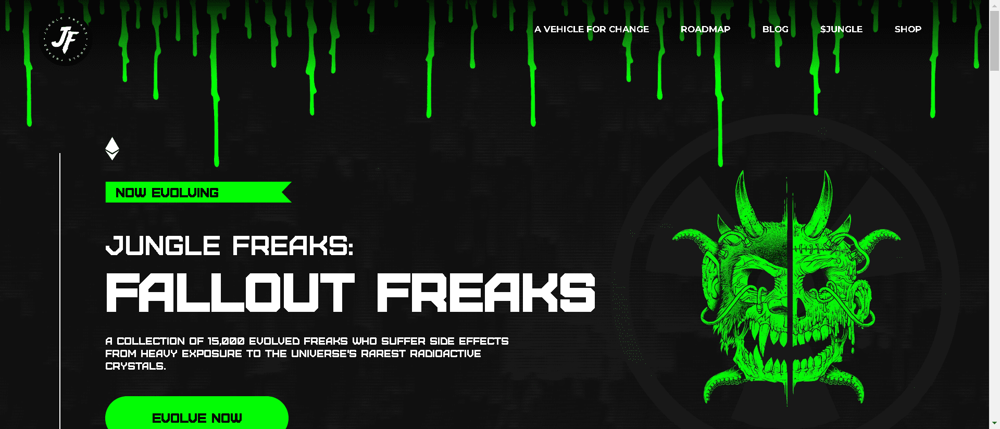

丛林怪胎：
辐射怪胎
15,000 名进化怪胎的集合，他们因大量暴露于宇宙中最稀有的放射性晶体而遭受副作用。

Fallout Freaks 由 5,000 个前所未见的 Fallout 测试对象和 10,000 个 Fallout Crystal Freaks 组成。

辐射测试对象具有 100% 独特的特征组合。有几个令人垂涎的 LVL 3 (1:1) Fallout Freaks 有 3 个不同的稀有级别。

辐射水晶是地球上最受追捧的元素。将您的 JF Genesis 暴露在 3 级稀有放射性辐射水晶中的一种，并生成您的 JF Genesis 的心灵融化进化版本。

