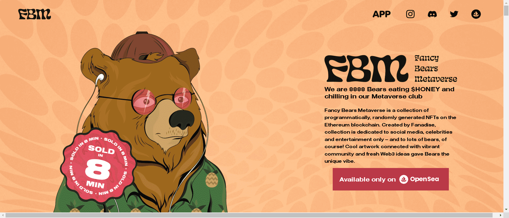

Fancy Bears Metaverse 是以太坊区块链上 8888 个以编程方式生成的化身的动态 NFT 集合。熊喜欢游艇、良好的氛围——还有亲爱的。所有的女孩都喜欢花式熊！

我们发明了 Trait Swap，这是第一个动态 NFT 平台，您可以在其中使用来自不同高端品牌的特征来个性化您的 PFP。  

我们拥有来自加密空间、时尚、生活方式和 NFT 领域的 50 多个合作伙伴，包括 Binance、Crypto.com、eToro、Vlaunch、GamerHash、Diesel 等。  

