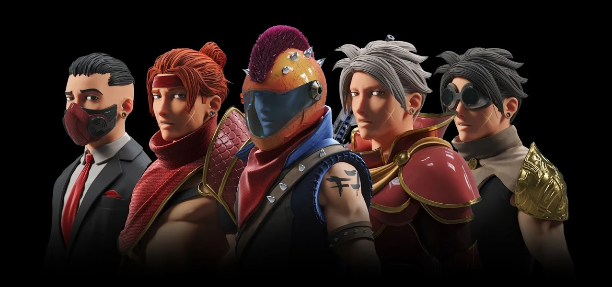

7,777 个独特的动漫角色，灵感来自历史上最流行的游戏之一，为您带来独一无二的虚拟世界。

▶ 什么是 Fantasy7 NFT 官方？
Fantasy7 NFT Official 是一个 NFT（非同质代币）集合。存储在区块链上的数字艺术品集合。

▶ Fantasy7 NFT 官方代币有多少？
总共有 274 个 Fantasy7 NFT 官方 NFT。目前 164 位所有者的钱包中至少有一个 Fantasy7 NFT 官方 NTF。

