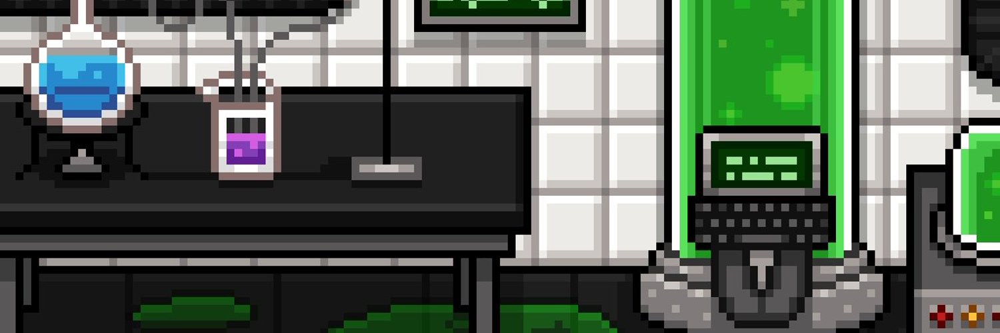

4,614 位疯狂科学家的集合，其中包括 10 位天才科学家，他们生产用于未来实验的小瓶代币。这就是科学发生的地方。Far Fetched Labs - 让我们走得更远！

▶ 什么是 Far Fetched Labs 原创作品？
Far Fetched Labs Original 是一个 NFT（不可替代令牌）集合。存储在区块链上的数字艺术品集合。

▶ 有多少个 Far Fetched Labs Original 代币？
总共有 1,254 个 Far Fetched Labs Original NFT。目前，473 位所有者的钱包中至少有一个 Far Fetched Labs Original NTF。

