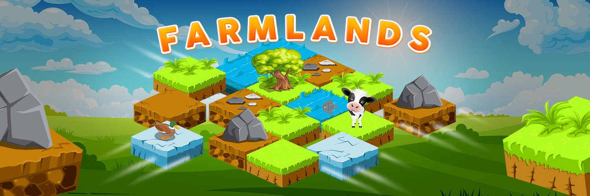

收集独特的农田。每个农田是一组 9 个随机生成的瓦片。瓷砖的独特性各不相同。

10,000 个独特而美丽的农田

▶ 什么是 Farmlands biz？
Farmlands biz是一个 NFT（非同质代币）集合。存储在区块链上的数字艺术品集合。

▶ 存在多少 Farmlands biz 代币？
总共有 4 个 Farmlands biz NFT。目前 2 位所有者的钱包中至少有一个 Farmlands biz NTF。

