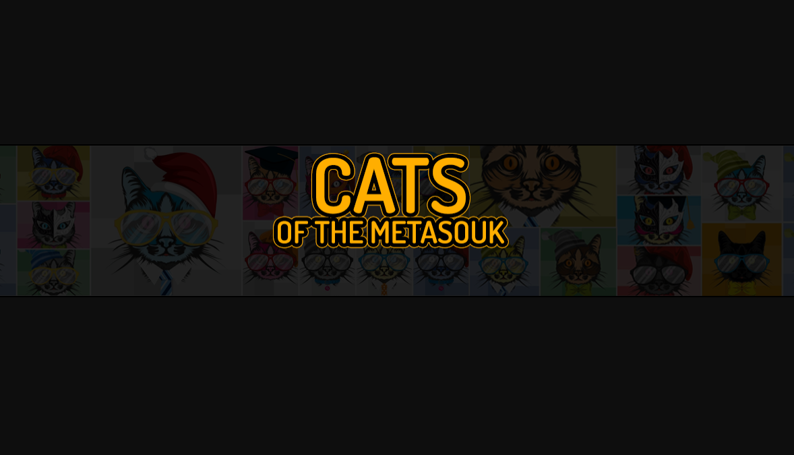

MetaSouck 的猫是 1,000 只独特的猫的集合，它们以 NFT 的形式生活在区块链上。

猫作为 ERC721 代币存储在以太坊区块链上。业主可以下载 .png 格式的猫，他们还可以请求它们的高分辨率图像，很快就会为每个人提供 3D 模型。

Cats dope 设计的角色收藏品不仅是您进入独家内容世界的门票。从开发新系列以填充我们的宇宙，到 MetaSouck 头像，我们正在开发一系列很棒的功能。

