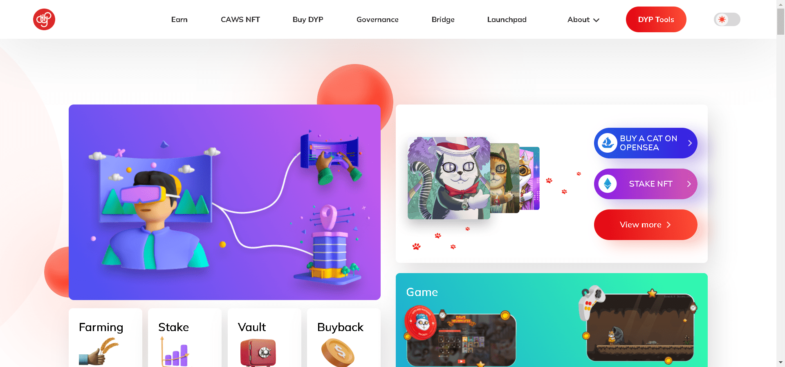

Cats and Watches Society (CAWS) 是由 DeFi Yield Protocol 开发的 10,000 个 NFT 的集合，DeFi Yield Protocol 是去中心化金融领域最有经验和创新的项目之一。在收养过程中，您的猫将配备一块很酷的豪华手表，并且还可以让您进入仅限会员的社会福利区。作为猫的新主人，您将获得 10% 的铸币费，并可以加入 CAWS 质押池获得 ETH 奖励。Cats and Watches Society 也在构建自己的 Metaverse，其中一个令人兴奋的游戏赚钱 (P2E) 游戏仍在开发中。

