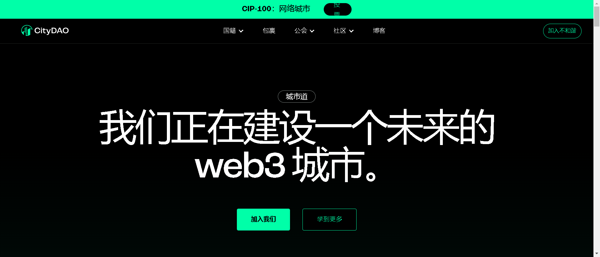

公民 NFT 持有者是 CityDAO 的公民，授予社区访问权和治理权。

CityDAO 正在探索链上去中心化资产所有权，从怀俄明州的一块土地开始。每块土地都是一个 NFT，可以由 DAO 集体管理。CityDAO 与全球人才库一起成长，致力于为 DAO 治理、经济适用房、城市建设等创建 web3 解决方案。

数字化有形资产使访问民主化、提高透明度、消除看门人并降低复杂性。将土地上链有几个好处：即时土地转让、降低法律复杂性和通过众筹实现所有权民主化。目前，土地只提供给能够买得起整块土地的大投资者。

