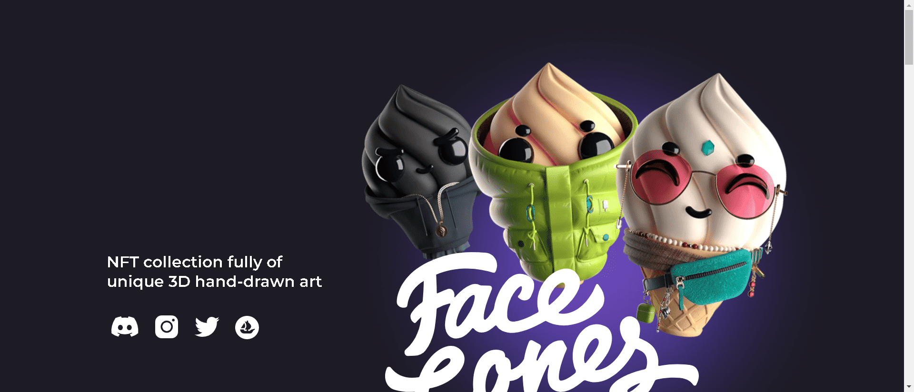

当你第一次看到一个冰淇淋蛋筒时，你会觉得你事先不知道它的味道。但不是在 FaceCones 宇宙中！

有数百个独特的角色，他们看起来像现在生活在这个世界上的人。也许有人甚至会找到他个人的“精神冰淇淋”（如“精神动物”）。这都是因为他们有相似的兴趣、生活故事和文化认同。

你可以在每一个详细的、手绘的、独特的 NFT 片段中看到它。该项目的作者在千年之交长大，并且确切地知道如何通过他的外表、他的外表和他的情绪巧妙地反映一个角色的背景故事。

