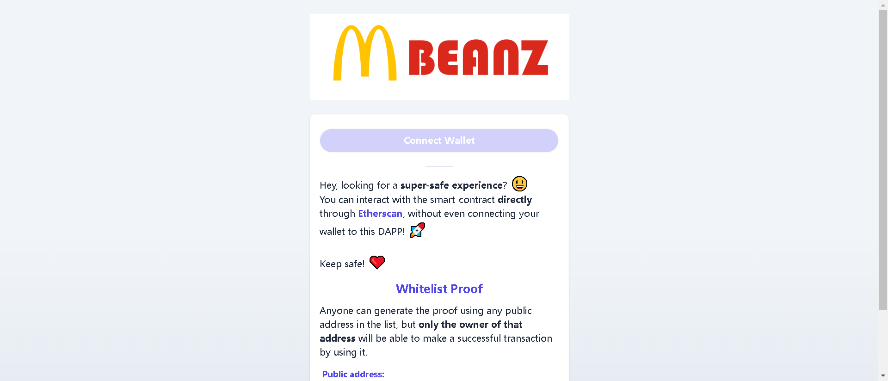

一个有趣的系列，灵感来自快餐 meme 和 Azuki BEANZ。该项目是对 OG BEANZ 的模仿，不隶属于 Azuki BEANZ 官方收藏

▶ 什么是快餐BEANZ？
快餐 BEANZ 是一个 NFT（非同质代币）集合。存储在区块链上的数字艺术品集合。

▶ 快餐 BEANZ 代币有多少？
总共有 2,960 个快餐 BEANZ NFT。目前，930 位业主的钱包中至少有一份快餐 BEANZ NTF。

▶ 什么是最昂贵的快餐 BEANZ 销售？
售出的最昂贵的快餐 BEANZ NFT 是 Fast Food BEAN #2036。它于 2022 年 6 月 13 日（2 个月前）以 1.5 美元的价格售

