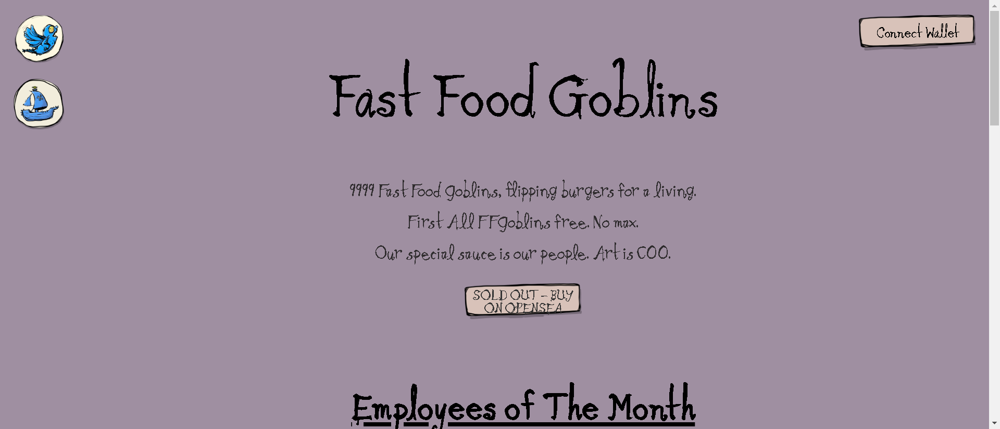

▶ 什么是快餐妖精？
FastFoodGoblins 是一个 NFT（非同质代币）集合。存储在区块链上的数字艺术品集合。

▶ 有多少个 FastFoodGoblins 代币？
总共有 109 个 FastFoodGoblins NFT。目前 2 位所有者的钱包中至少有一个 FastFoodGoblins NTF。

▶ 什么是最昂贵的快餐妖精销售？
售出的最昂贵的 FastFoodGoblins NFT 是 快餐地精 #4。它于 2022-06-07（3 个月前）以 36.3 美元的价格售出。

