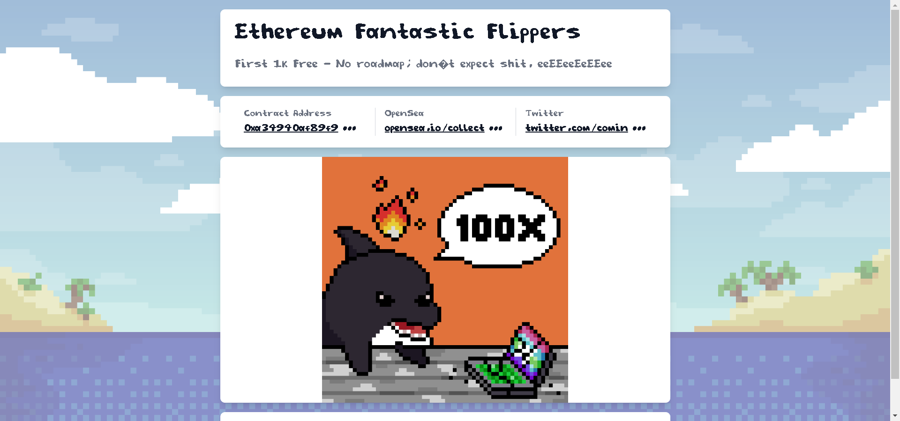

当突然被扔进一个加密货币的世界时，他在大海中游泳，一点也不在乎。他很快意识到自己有问题。让我们跟随 Flipper 尝试穿越元宇宙。

▶ 什么是 Flipper-Flipper？
Flipper-Flipper 是一个 NFT（Non-fungible token）集合。存储在区块链上的数字艺术品集合。

▶ 存在多少个 Flipper-Flipper 代币？
总共有 1,121 个 Flipper-Flipper NFT。目前，376 位车主的钱包中至少有一个 Flipper-Flipper NTF。

▶ 什么是最昂贵的 Flipper-Flipper 销售？
售出的最昂贵的 Flipper-Flipper NFT 是 Flipper-Flipper #907。它于 2022-07-03（大约 2 个月前）以 0.1 美元的价格出售。

