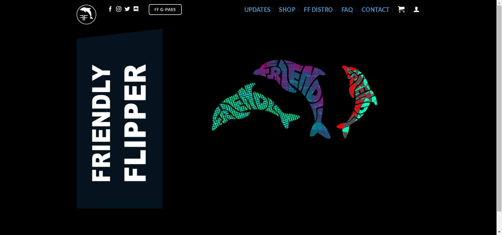

FlipperAi 是一个正在进行的 NFT 集合，旨在纪念曾经繁华的 Friendly Waffles Facebook 群组。

以 ERC-1155 代币的形式诞生在以太坊区块链上，每一个独特的艺术系列都是由海豚和人工智能之间的各种合作创造的。

注意：通过购买 FlipperAi NFT，每位购买者将收到一份（每个 FlipperAi 最多 3 个）通过实时验证随机发生器赠送的特别友好 Flipper 赠品！

