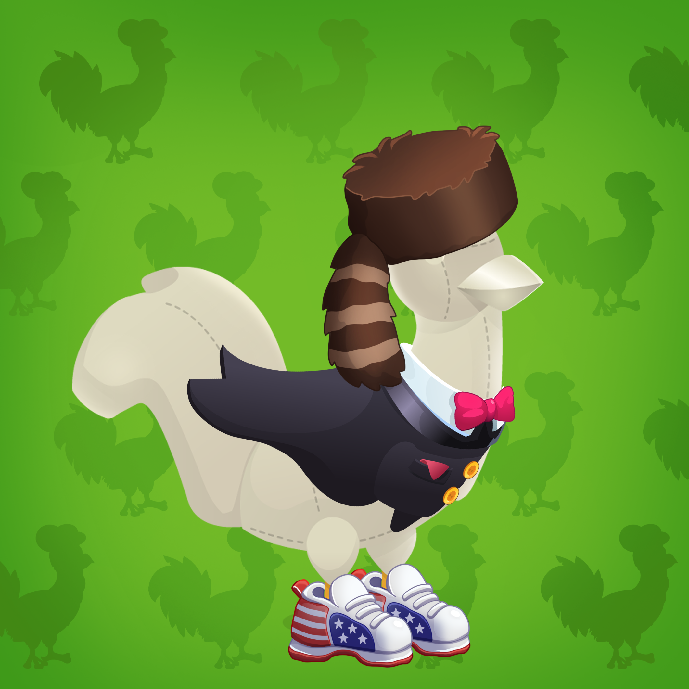

11 个不同世界的 13,333 个独特地块的有限资源。[学到更多。](https://bitlovin.gitbook.io/chicken-derby-tutorial/chicken-derby-worlds)掉落1：限时。更低的价格。仅限鸡架。下降2：剩余库存。向所有人开放。日期和价格将很快公布。

让您的鸡在 6 个不同的距离和 7 个不同的地形上赛跑。发现你的鸡的距离和地形偏好，以提高你的胜率。
每只鸡的前 7 场比赛均可免费参加。

进入前 3 名的每只鸡都将分享奖池！第三名 15%，第二名 30%，第一名高达 55%！

