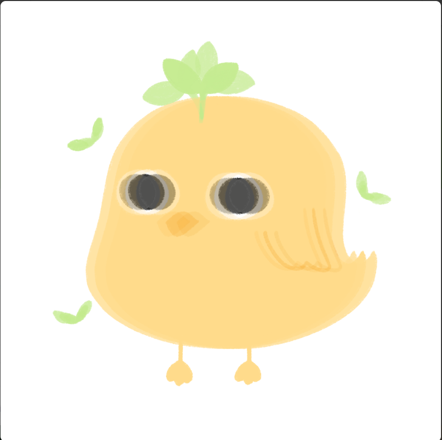

##### ▶ 什么是小鸡小鸡？

Chick Chick 是一个 NFT（非同质代币）集合。存储在区块链上的数字艺术品集合。

##### ▶ 有多少 Chick Chick 代币？

总共有 70 个 Chick Chick NFT。目前，14 位所有者的钱包中至少有一个 Chick Chick NTF。

##### ▶最近卖了多少Chick Chick？

过去 30 天内售出 0 个 Chick Chick NFT。

