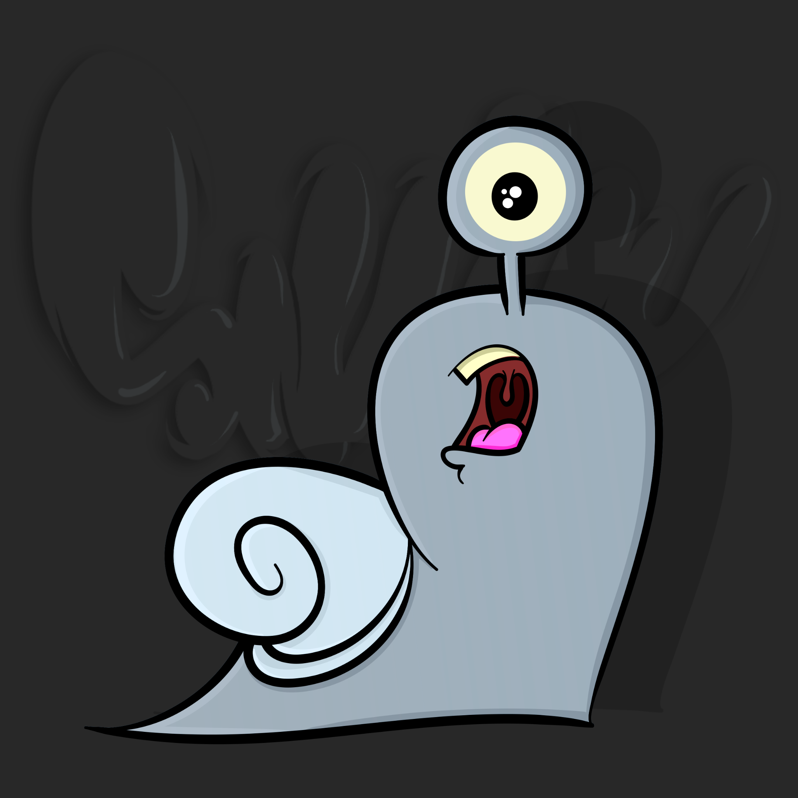
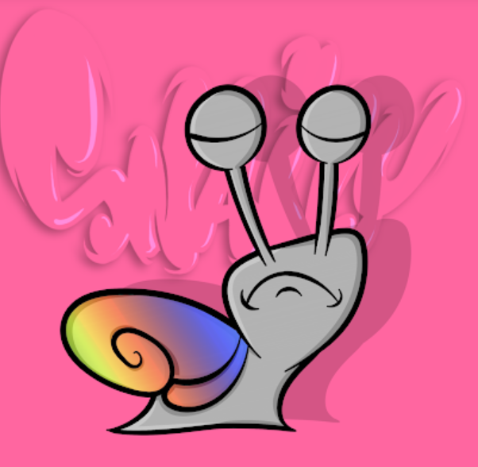
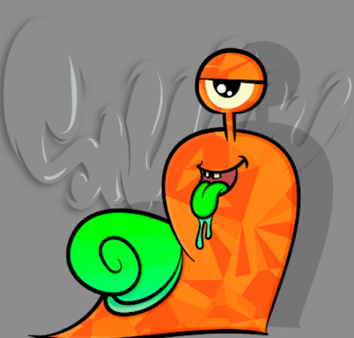

项目网站、社交联系方式、项目介绍内容详见：https://opensea.io/collection/foursnails

1001 只独特的、可繁殖的蜗牛在区块链中生活、热爱和战斗。每个购买 FourSnails NFT 的人都将获得来自同伴收藏的一个 NFT。我们将每月赠送一个新的伴侣 NFT。

FourSnails 是一个 NFT（非同质代币）集合。存储在区块链上的数字艺术品集合。

总共有 101 个 FourSnails NFT。目前，19 位所有者的钱包中至少有一个 FourSnails NTF。

