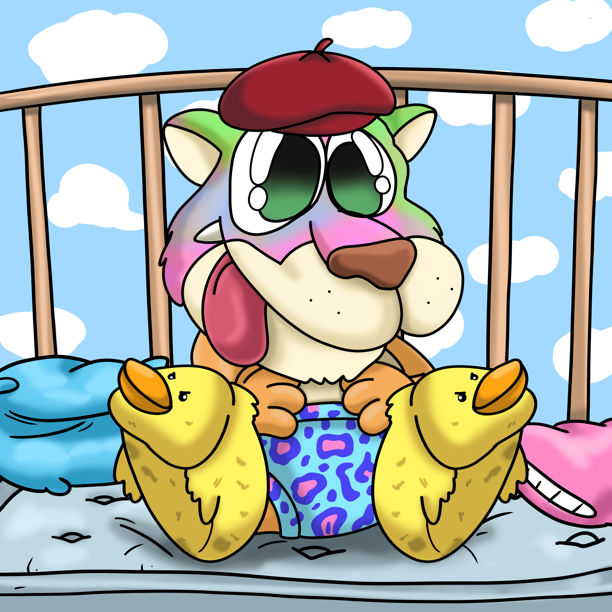

项目网站、社交联系方式、项目介绍内容详见：https://opensea.io/collection/freakylabs

我们是世界的怪胎！ Genesis Freaks 2D、3D 及其他 一起想象未来作为一个社区

怪异是新常态Freaky Labs 是 600 只起源幼崽的集合，它们从一个邪恶的实验室逃脱，在那里他们成为可怕实验的受害者

这些实验导致了令人费解的突变，使它们变成了 Freaks。这些幼崽因与众不同而被社会抛弃，现在在怪异的宇宙中游荡

寻找自己的部落并在更加开放的环境中重建生活。

一个超越物理和数字的世界，创造出超出你最疯狂梦想的东西。重新定义成为 Web3 爱好者的意义，同时将我们的创意能力推向极致。

