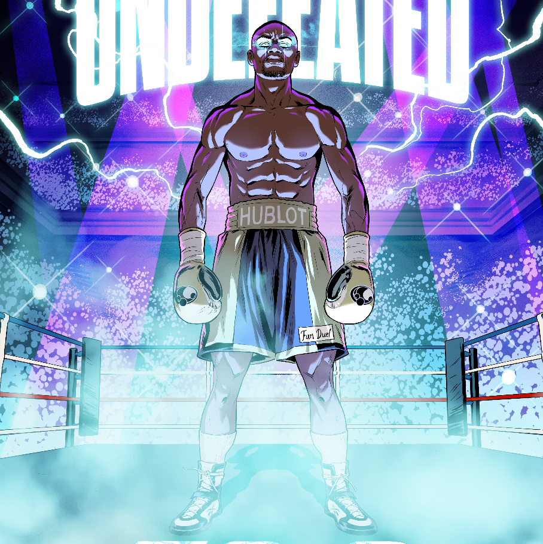

Hero Projects 的 Floyd Mayweather Undefeated Comic Book Collection 包含一组有限的五 (5) 个漫画封面 NFT，通过空投独家提供给 Floyd's World NFT 的持有者。

由著名的 Hero Projects 团队创作，这本就职漫画书颂扬了不败传奇人物弗洛伊德梅威瑟的标志性生活和遗产，并将作为数字第一版发行，之前是漫画封面 NFT。

一个有限的 NFT 集合，其中的代币让你可以访问 Floyd 的社区。

Hero Projects NFT 共有 1,951 部 The Floyd Mayweather Undefeated Comic Book Collection

目前，1,891 位所有者的钱包中至少有一本由 Hero Projects NTF 出品的 The Floyd Mayweather Undefeated Comic Book Collection。

