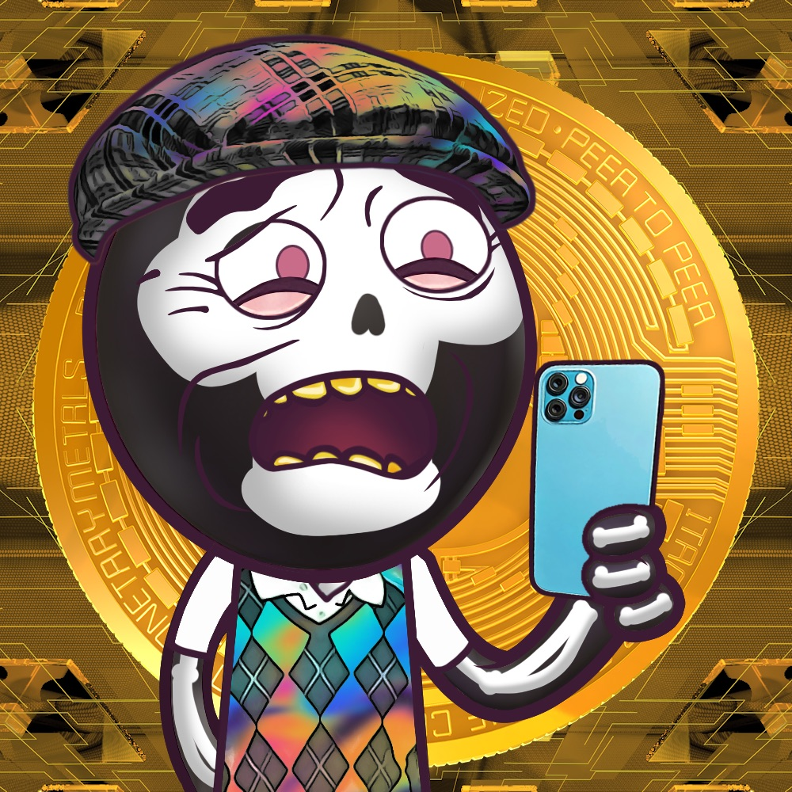

项目网站、社交联系方式、项目介绍内容详见：https://opensea.io/collection/citizen-pink-nft-official-collection

我们汇集了6,170名轰动一时的公民，他们使用充满令人难以置信的特征的 AI 生成（和人工策划！）设计数据库精心手工制作！它们具有一系列非凡的风格，包括僵尸、吸血鬼、综合格斗等等！

任何有价值的可变特性存储都为看不见的稀有性提供了绝佳的机会来展示自己 - 而 Citizen Pinks 则包含如此奇怪、出乎意料、诱人和非常规的稀有！这些杰出的公民预计会下降！

当然，您不仅可以获得您的 Citizen 的全部商业权利 - 以您认为合适的方式使用 - 而且您还将立即加入我们令人惊叹的社区！我们正在运营一个合法的包容性和令人难以置信的友好环境，以与像您一样志同道合且客观上很棒的成员建立联系！

