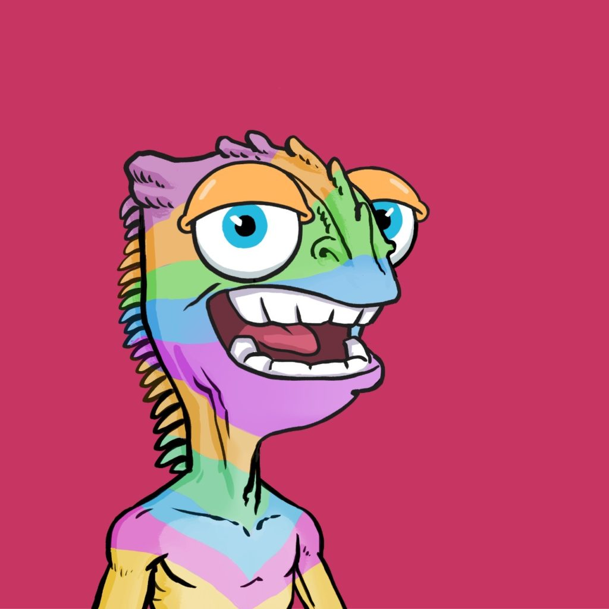
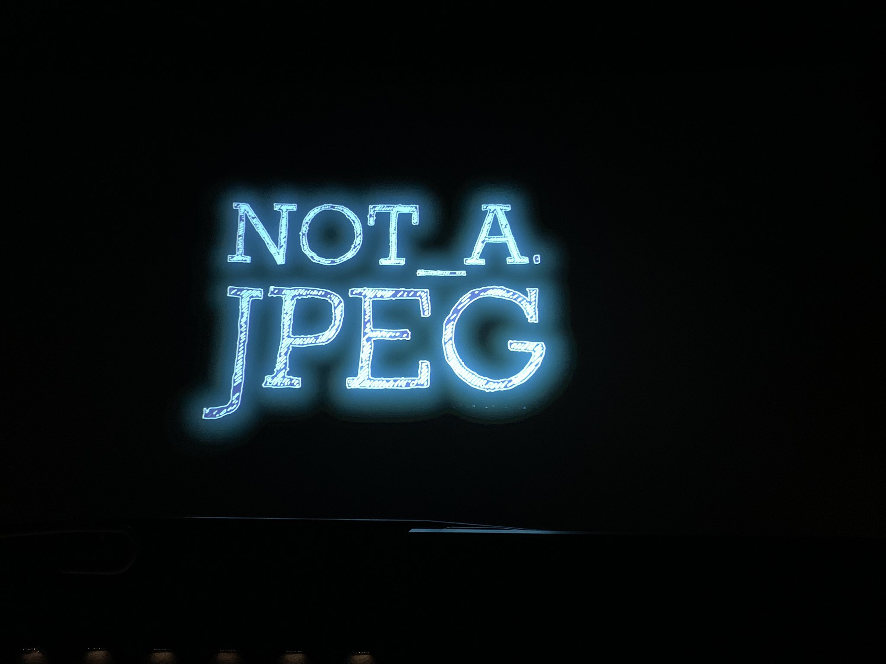
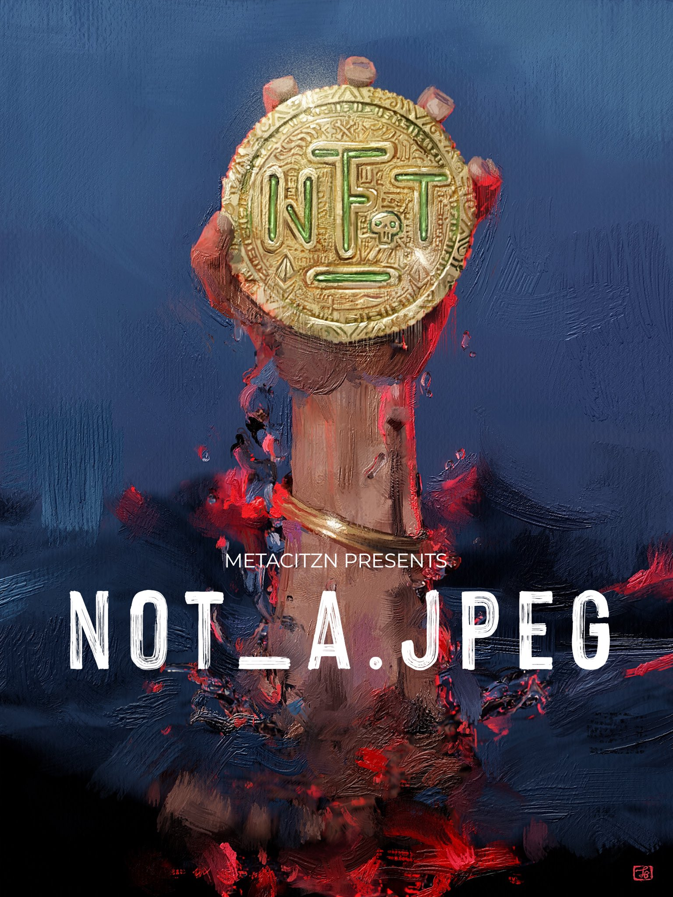

项目网站、社交联系方式、项目介绍内容详见：https://opensea.io/collection/citznstudios

METACITZN是世界上第一个去中心化媒体制作集体。我们的电影和体验以来自 Cool Cats、 Pixel Vault、 Gutter Cat Gang、 Ghxsts、 World of Women、 Vinnie Hager、 Joel Madden、 M.Shadows、 Misan Harriman、 Flula Borg 等NFT 艺术家、收藏品、名人和影响者为特色其他。每个 CITZN 都是工作室的一部分，他们在那里合作制作，CITZN 代币在 MC 世界中解锁了令人难以置信的实用性。CITZN 社区的目标是在每个代币背后都写一个故事，并创建与 Ready Player One 的 Halliday Journals 档案相同的 Metaverse。

