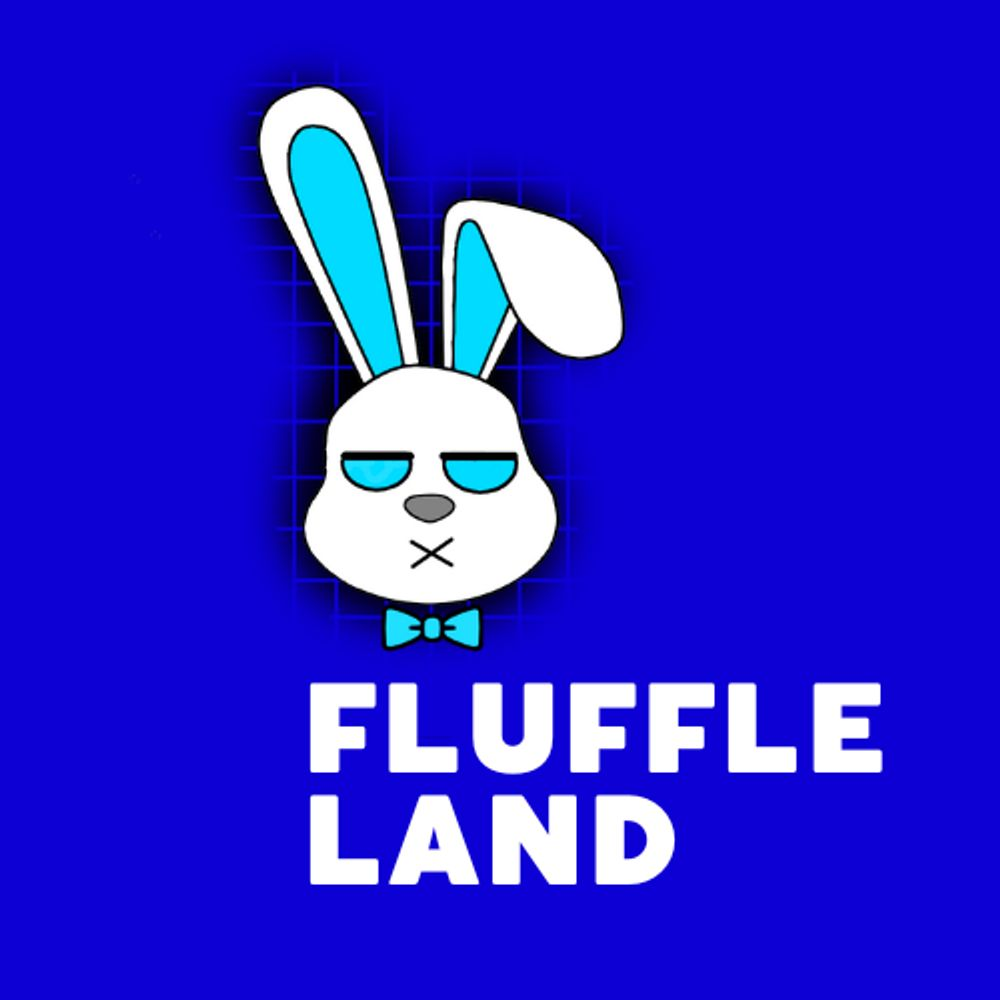

在遥远的土地上。有一块土地，叫做绒毛之地。它是 Fluffles 的家，或者我们可以说是 Group Bunnies、Rabbits 和 Bun Buns 的家。FluuffleLand 官方主系列拥有超过 2,222 种独特的皮肤，专为冒险中将面临的不同任务和挑战而设计。

只需持有 Fluuffle 官方，您就可以访问 fluffle 未来游戏、赠品、代币分配、商品折扣，最后免费薄荷访问 fluffle 子系列。

我们了解这些世界之间交叉的重要性，我们真正相信将这两者联系在一起。我们的目标将始终是保护环境和加密社区的意识。

