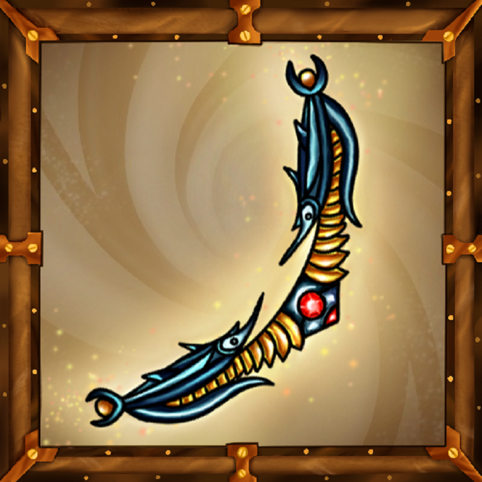
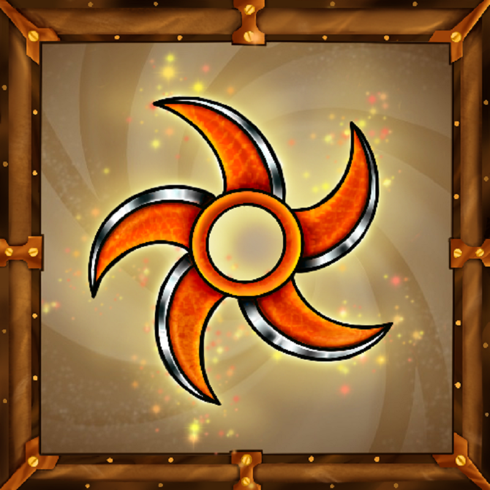
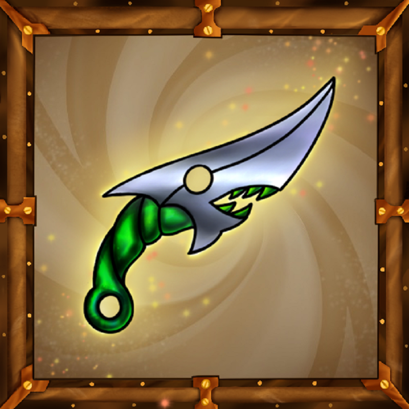

项目网站、社交联系方式、项目介绍内容详见：https://opensea.io/collection/forest-knight

Forest Knight 将休闲手机游戏与区块链游戏相结合，提供令人惊叹的冒险、引人入胜的故事、具有特殊能力的独特英雄以及为每位英雄设计的独家 NFT。该游戏具有令人惊叹的功能，专注于 PVE 和 PVP。在森林骑士的领域中，NFT 是专为每位英雄设计的独特、独家且强大的物品。它们的价值取决于它们的稀有性和强度。越稀有，数量就越少，某些类别的 NFT 仅存在 10 个。目前这些 NFT 可以是武器、配饰和皮肤，但我们计划在未来添加更多独特的收藏品，例如宠物、土地等等！

