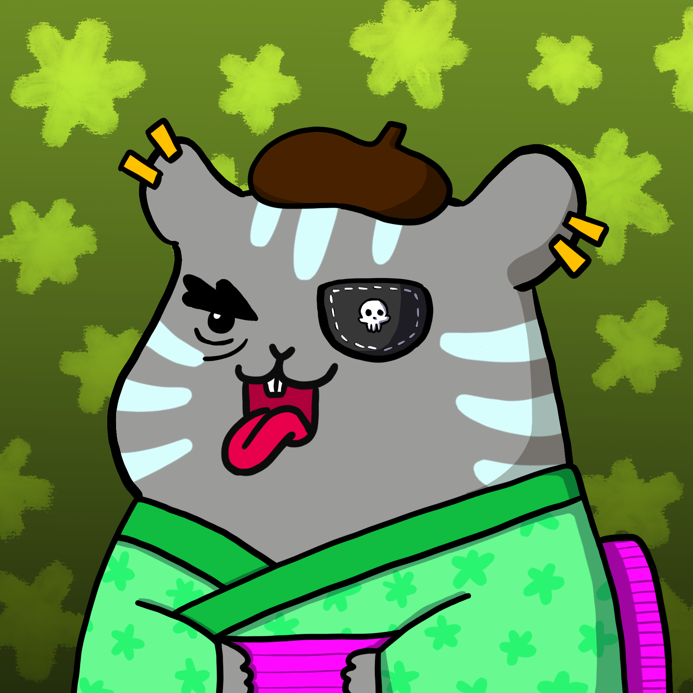

项目网站、社交联系方式、项目介绍内容详见：https://opensea.io/collection/chonkys

 ▶ 什么是 Chonky's？

Chonky's 是一个 NFT（非同质代币）集合。存储在区块链上的数字艺术品集合。

##### ▶ Chonky 的代币有多少？

总共有 1,856 个 Chonky 的 NFT。目前，313 位所有者的钱包中至少有一个 Chonky 的 NTF。

##### ▶ 最近卖出了多少 Chonky's？

过去 30 天内售出 0 个 Chonky 的 NFT。

##### ▶ 什么是流行的 Chonky 替代品？

许多拥有 Chonky 的 NFT 的用户还拥有 [MGC NFT](https://www.nft-stats.com/collection/mgc-nft)、 [Zeblocks 的 Beatboxes](https://www.nft-stats.com/collection/beatboxes-by-zeblocks)、 [Mojimonsters](https://www.nft-stats.com/collection/mojimonsters)和 toiminto 的[Augmented Sequence](https://www.nft-stats.com/collection/augmented-sequence-by-toiminto)。 

