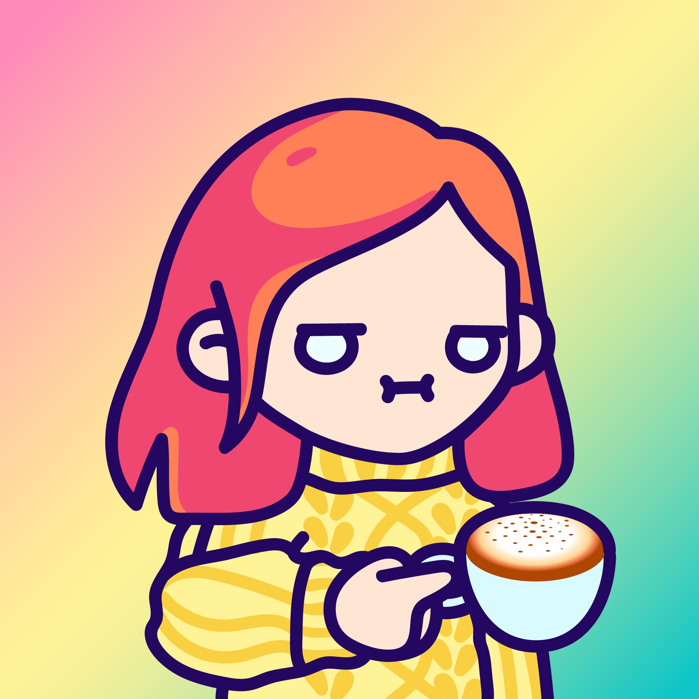
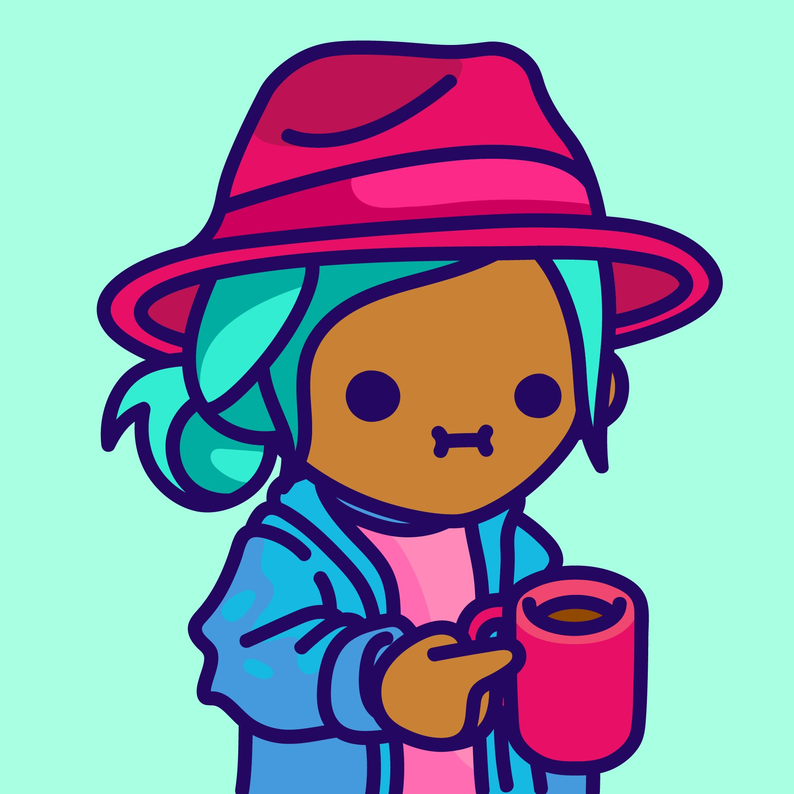

项目网站、社交联系方式、项目介绍内容详见：https://opensea.io/collection/cjc

在这个技术让我们感到更加孤立的世界里，我们决定创建一个专注于社区的项目。我们都同意，一杯好咖啡非常接近一个美好的拥抱。因此，这是我们与 6,000 名独特冲泡咖啡爱好者的拥抱。

一个志趣相投的人可以一起喝咖啡的俱乐部。俱乐部的目标是为社区提供折扣、面对面的聚会、独特的咖啡合作和有趣的联系方式。整个社区可以聚集在一起，通过对提案进行投票来帮助决定俱乐部的愿景。

它最初是 0.05ETH，但我们退还了所有人并将其转换为免费铸币厂。每个钱包 2 枚薄荷糖。

总供应量 6000。5% 将由团队持有，用于赠送和加入咖啡合作伙伴

