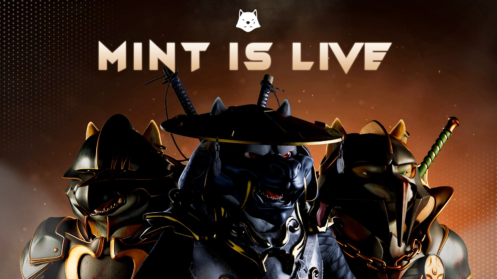
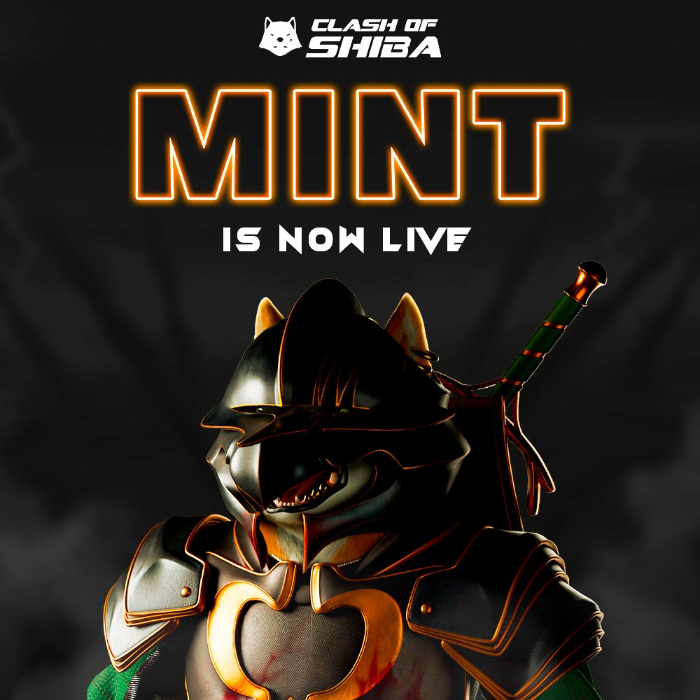
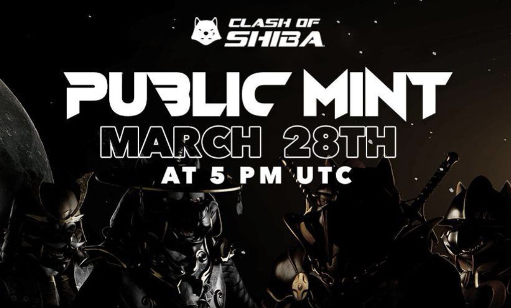

项目网站、社交联系方式、项目介绍内容详见：https://opensea.io/collection/clashofshibanft-official

▶ 什么是芝的冲突？
Shiba 的冲突是一个 NFT（不可替代令牌）集合。存储在区块链上的数字艺术品集合。
▶ 存在多少个 Clash of Shiba 代币？
Shiba NFT 的冲突总共有 567 个。目前，338 位车主的钱包中至少有一本 Clash of Shiba NTF。
▶ 最近卖出了多少《Clash of Shiba》？
过去 30 天内共售出 0 个 Shiba NFT 的 Clash。
▶ 有哪些流行的 Clash of Shiba 替代品？
许多拥有 Shiba NFT 冲突的用户还拥有 I ADORE YOUR...、 DSC Community Pixel Village、 CBirdz.xyz和 TJT Genesis。

