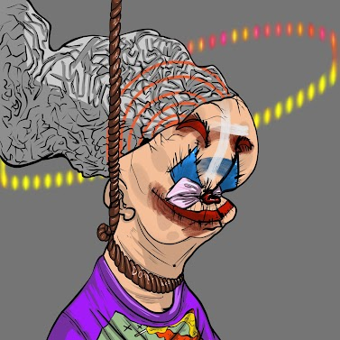
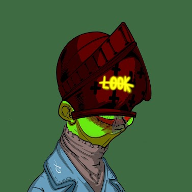
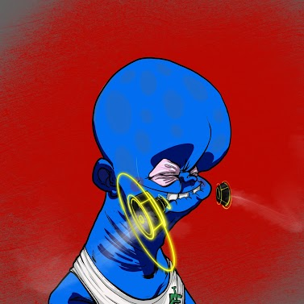

项目网站、社交联系方式、项目介绍内容详见：https://opensea.io/collection/clones-never-die-mu

当初独自存在的神，直接分身重生为101个不同外貌和身份的分身。然而，与建设一个各种意识形态并存的国家的初衷相反，101个不同品味和意识形态的克隆人未能达成共识，决定为每个人建立一个国家。故事开始于通过交换 101 个分身的神力来建立他们的星球，创建了一支由 10,000 个下级分身组成的军队。

